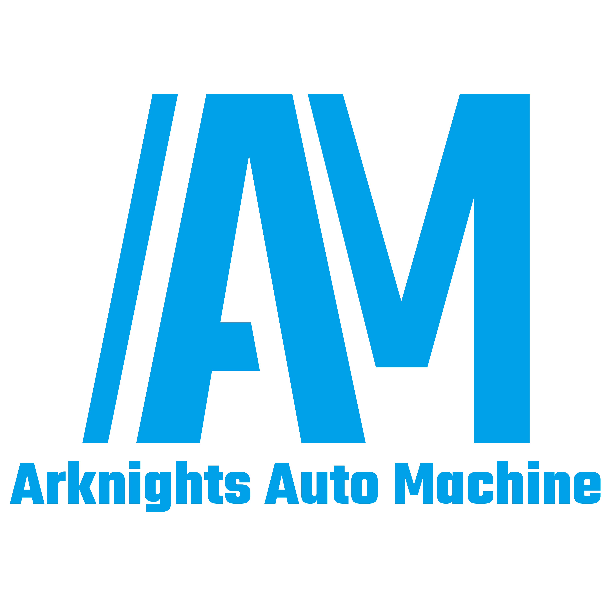

# Arknights Auto Machine (AAM)



## 项目概述

Arknights Auto Machine (AAM) 是一个工业级的明日方舟自动化系统，采用分层架构设计（L0-L5），结合 C++ 实时核心与 Python AI 推理，实现智能化的游戏自动化。

## 架构设计

```
┌─────────────────────────────────────────────────────────────┐
│                        GUI Layer                            │
│  ┌─────────────┐  ┌─────────────┐  ┌─────────────────────┐ │
│  │   Qt6       │  │    WPF      │  │   Web (Optional)    │ │
│  │ (Cross-Plat)│  │  (Windows)  │  │                     │ │
│  └──────┬──────┘  └──────┬──────┘  └──────────┬──────────┘ │
└─────────┼────────────────┼────────────────────┼────────────┘
          │                │                    │
          └────────────────┴────────────────────┘
                             │
┌────────────────────────────┼────────────────────────────────┐
│                      AAM Core (C++)                         │
├────────────────────────────┼────────────────────────────────┤
│  L4 State    │  游戏状态机、快照序列化、数据持久化            │
├──────────────┼──────────────────────────────────────────────┤
│  L3 Tactical │  战术原语、DSL编译器、费用管理                │
├──────────────┼──────────────────────────────────────────────┤
│  L2 Motor    │  操作执行、坐标变换、人性化模拟               │
├──────────────┼──────────────────────────────────────────────┤
│  L1 Perception│ GPU图像处理、目标检测、OCR                   │
├──────────────┼──────────────────────────────────────────────┤
│  L0 Sensing  │  屏幕捕获、设备通信、共享内存传输             │
└──────────────┴──────────────────────────────────────────────┘
                             │
                    ┌────────┴────────┐
                    │   Bridge Layer   │
                    │  (gRPC / SHM)   │
                    └────────┬────────┘
                             │
┌────────────────────────────┼────────────────────────────────┐
│                   AAM Inference (Python)                    │
├────────────────────────────┼────────────────────────────────┤
│  L5 Strategy  │  LLM/VLM决策、战术规划、长期记忆             │
├──────────────┼──────────────────────────────────────────────┤
│  Vision       │  高层视觉分析、编队识别、状态检测             │
├──────────────┼──────────────────────────────────────────────┤
│  Data         │  关卡数据、干员数据库、敌人图鉴               │
└──────────────┴──────────────────────────────────────────────┘
```

## 目录结构

```
ArknightsAutoMachine/
├── .github/           # CI/CD 配置
├── docs/              # 技术文档
├── proto/             # 协议定义
├── core/              # C++ 核心 (L0-L4)
├── bridge/            # 语言桥接层
├── gui/               # 多前端实现
├── inference/         # Python 推理 (L5)
├── tools/             # 开发工具
├── configs/           # 配置模板
├── scripts/           # 运维脚本
├── tests/             # 端到端测试
├── third_party/       # 外部依赖
└── cmake/             # CMake 模块
```

## 快速开始

### 环境要求

- Windows 11 / Linux / macOS
- Python 3.11+
- CMake 3.25+
- Visual Studio 2022 (Windows) / GCC 13 (Linux)

### 安装依赖

```powershell
# Windows
.\scripts\setup\install_deps_windows.ps1

# Linux/macOS
./scripts/setup/setup_vcpkg.sh
```

### 构建项目

```bash
# 生成协议代码
python scripts/codegen/protobuf_gen.py

# 配置构建
cmake --preset=windows-cl-x64

# 编译
cmake --build --preset=windows-cl-x64-release
```

### 运行

```bash
# 启动 C++ 核心
./build/core/Release/AAMCore.exe

# 启动 Python 推理服务
cd inference
poetry run python -m aam_llm
```

## 技术特性

### 实时性能
- 144Hz 屏幕捕获，延迟 < 16ms
- GPU 加速图像处理
- 零拷贝共享内存传输

### AI 决策
- 支持 GPT-4V、Claude 3、本地 LLaVA
- 流式推理，思维链监控
- 自动回退到规则引擎

### 跨平台
- Qt6 跨平台 GUI
- WPF Windows 原生体验
- 统一的抽象接口

### 工程化
- 完整的 CI/CD 流程
- 90%+ 测试覆盖率
- 静态分析、模糊测试

## 文档

- [架构设计](docs/architecture/)
- [API 文档](docs/api/)
- [开发指南](docs/dev-setup.md)
- [路线图](develop_plan/ROADMAP.md)

## 贡献

请参阅 [CONTRIBUTING.md](.github/CONTRIBUTING.md)。

## 许可证

AGPL-3.0 License
